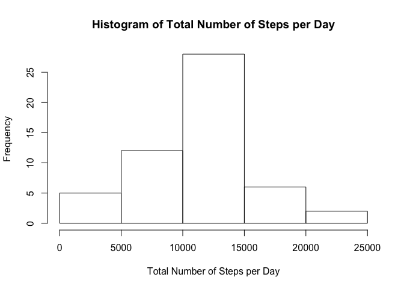
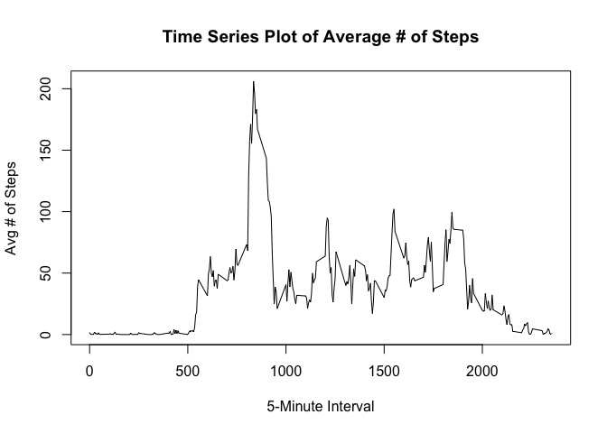
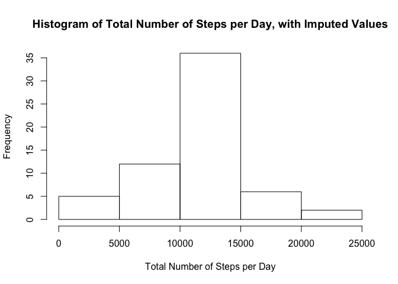
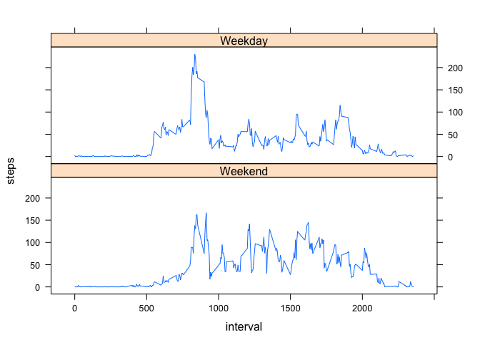

# Reproducible Research: Peer Assessment 1


## Loading and preprocessing the data


```r
act<-read.csv("activity.csv")
act$date<-as.character(act$date)
```

## What is mean total number of steps taken per day?


```r
a<-act[which(!is.na(act$steps)),]
tot<-tapply(a$steps,a$date,sum)
par(mfrow=c(1,1))
hist(tot, xlab="Total Number of Steps per Day", ylab="Frequency", main="Histogram of Total Number of Steps per Day")
```

 

```r
mean<-mean(tot)
med<-median(tot)
```

The mean number of total steps per day is 1.0766189\times 10^{4}. The median number of total steps per day is 10765.

## What is the average daily activity pattern?

Let's calculate the average number of steps, in 5 minute intervals, taken across all days.


```r
avg<-tapply(a$steps,a$interval,mean)
plot(unique(a$interval),avg, type="l",xlab="5-Minute Interval", ylab="Avg # of Steps",main="Time Series Plot of Average # of Steps")
```

 

```r
b<-which.max(avg)
c<-as.integer(names(b))
```

The 5-minute interval with the highest number of average steps (across all days) is 835.

## Imputing missing values


```r
d<-sum(is.na(act))
```

There are 2304 missing values in the dataset.


```r
agg<-suppressWarnings(aggregate(act,by=list(act$interval),FUN=mean,na.rm=TRUE))
agg2<-agg[,c("interval","steps")]
names(agg2)<-c("interval","mean.steps")
all<-merge(act,agg2,by="interval")
all<-all[order(all$date),]
suppressWarnings(library(dplyr))
```

```
## 
## Attaching package: 'dplyr'
## 
## The following object is masked from 'package:stats':
## 
##     filter
## 
## The following objects are masked from 'package:base':
## 
##     intersect, setdiff, setequal, union
```

```r
all2<-mutate(all,steps2=ifelse(is.na(steps),mean.steps,steps))
all3<-all2[,c(1,3,5)]
names(all3)[3]<-"steps"
tot3<-tapply(all3$steps,all3$date,sum)
par(mfrow=c(1,1))
hist(tot3, xlab="Total Number of Steps per Day", ylab="Frequency", main="Histogram of Total Number of Steps per Day, with Imputed Values")
```

 

```r
mean3<-mean(tot3)
med3<-median(tot3)
```

Using imputed values for NAs, the mean number of total steps per day is 1.0766189\times 10^{4}. The median number of total steps per day is 1.0766189\times 10^{4}. Therefore, the impact of imputed values on the mean is 0, and the impact on the median is -1.1886792.

## Are there differences in activity patterns between weekdays and weekends?


```r
all3$date<-as.POSIXct(all3$date)
all3$day<-weekdays(all3$date)
all3<-mutate(all3,f=ifelse(day=="Saturday"|day=="Sunday",0,1))
all3$f2<-factor(all3$f,labels=c("Weekend","Weekday"))

t<-suppressWarnings(aggregate(all3,by=list(all3$interval,all3$f2),FUN=mean))
t2<-t[,c(1,2,4,5)]
names(t2)[1:2]<-c("interval","daytype")
suppressWarnings(library(lattice))
xyplot(steps~interval | daytype,data=t2,layout=c(1,2), type="l")
```

 

Based on this plot, weekday activity levels seems to be higher in the morning, while on weekends it is more sustained throughout the day.
